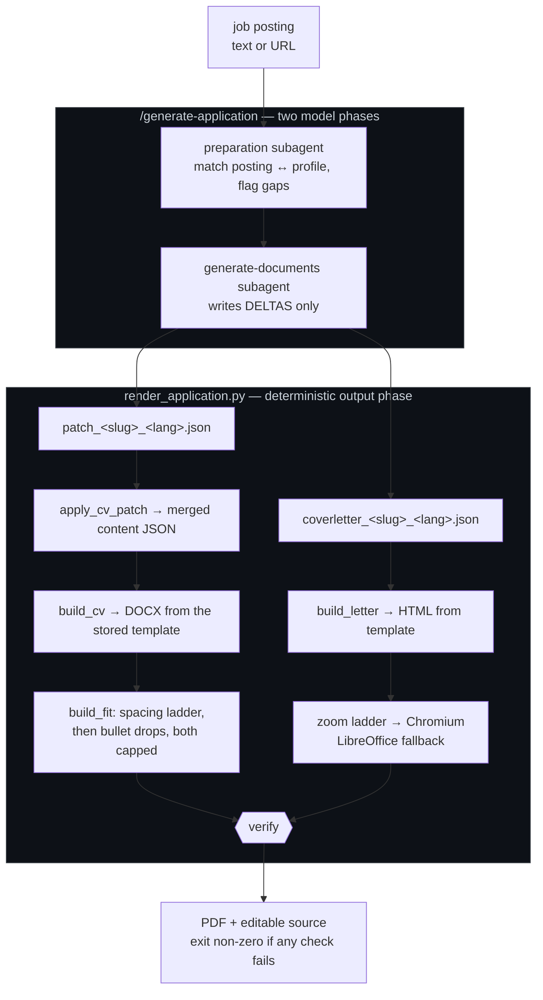

# applications

An agent-driven pipeline that turns a job posting into a tailored, ATS-ready CV
and cover letter, verified before it is handed over.

It is [applicant]'s real job-search workspace, kept public as an engineering
showcase. The interesting part is not that an LLM writes a cover letter. It is
**where the boundary between the model and the code was drawn**, and what
measuring that boundary was worth.

The scope stops at a finished PDF, deliberately: finding postings and sending
applications are separate problems, and both are discussed under
[Not in scope](#not-in-scope) rather than half-built here.

---

## The idea in one sentence

> The model emits only what is a judgement call. Everything mechanical — merging,
> templating, dating, page-fitting, dash hygiene, file naming, verification — is
> deterministic code.

That sounds obvious. It was not how the pipeline started, and the difference is
measurable in both money and correctness.

What that boundary cost to find, row by row, is in [Learnings](#learnings).

### The rule that keeps it honest

Everything is built only from facts in `profile.json`. The tooling enforces the
mechanical half of that: `apply_cv_patch.py` **fails loudly** on an ambiguous or
unmatched selector rather than silently dropping a job off the CV, and it emits a
warning when a `select` would remove a work-experience entry — because a missing
job is a gap in an employment history, and gaps get asked about in interviews.

---

## Architecture



`render_application.py` is also the **single definition of file naming**. No agent
prompt and no standards document may spell out an output filename; they ask the
script:

```bash
career-kb/tools/render_application.py --company <company-slug> --lang de --print-paths
```

Its verification step is not decorative — it fails the run if the PDF has the
wrong page count, if the text is not selectable, if an em dash survived, if the
application address is missing, or if the private email address leaked into a
document that should carry the application one.

---

## Layout

| Path | What it is |
|---|---|
| [`career-kb/`](career-kb/README.md) | The knowledge base: `profile.json` (single source of truth), channel-scoped writing standards, the DOCX templates, and the render tooling. |
| `.claude/` | The agents and slash commands that orchestrate the above (`/generate-application`, `/optimize-linkedin`). |
| `tests/` | 35 unit tests over the pure logic — text hygiene, patch merging, template filling, date formatting. |
| `CODING_RULES.md` | The rules every change to this repo follows. |
| `CLAUDE.md` | Operating instructions for the agent working in this repo. |
| `learnings.md` | The running log of what each measurement actually showed. |

### Which data is committed, and which is not

A pipeline without its data is a pipeline nobody can run, so the **role-generic**
data is in the repository on purpose:

- **`career-kb/profile.json`** — the fact base the whole system is built on.
  Without it, none of the "the model may only use facts from here" design is
  inspectable; you would have to take the claim on faith.
- **`career-kb/content/<role>_<lang>.json`** — the five role-optimized base CVs
  (EN + DE). These are the bases every tailored CV is a patch *against*, so they
  are what makes the delta format legible at all.
- **`career-kb/.digest/*.json`** — build artifacts, tracked deliberately. They are
  what the agents actually read instead of `profile.json`, so tracking them makes
  a stale digest show up in `git diff` rather than silently shipping outdated
  facts. A fresh clone also works with no build step.

**No company name belongs in this repository.** Who someone applied to, and when,
is nobody else's business — least of all a recruiter's, reading the repo she
linked in her application. So every per-application artifact stays on disk and out
of git: `content/offer_<company>_<lang>.json`, `content/patch_<company>_<lang>.json`,
the letter tone references in `examples/`, and the private source documents in
`career-kb/documents/` (Arbeitszeugnisse and certificates, which name former
employers). `.gitignore` enforces this by the naming convention itself, so a new
application is untracked the moment it is generated rather than by anyone
remembering. In `learnings.md` the runs are pseudonymised as **Company A–J**,
consistently, so each run can still be followed end to end.

Also not committed: the generated PDFs in `career-kb/output/` (reproducible in
~1.7s, so they are output, not knowledge) and the virtualenvs.

Two things are kept out for reasons worth stating:

- **`career-kb/assets/signature.png`** — the scanned signature the cover letter
  embeds. A signature image does not make a document legally binding (German law
  wants an *eigenhändige* signature for `Schriftform`, § 126 BGB), but it is
  trivially pasted under anything by whoever holds the file. So it stays local,
  and `build_letter.py` fails with instructions when it is missing rather than
  quietly shipping an unsigned letter.
- **the private email address** — the contact details in `profile.json` are the
  ones already printed on a CV that goes to strangers. The private address is a
  different one and is stored nowhere in this repository, because writing it down
  would publish exactly the string that needs protecting. `render_application.py`
  still checks that it never reaches a generated document; it reads the value from
  `CAREER_KB_PERSONAL_EMAIL` and reports `SKIP`, not `OK`, when that is unset — an
  unset variable must not be able to pass for a clean run.

---

## Quick start

```bash
# everything, exactly as CI runs it
make check

# just the parts you want
make lint typecheck test
make fix          # apply every safe autofix

# render an application from content that already exists
career-kb/tools/render_application.py --company <company-slug> --lang de
```

`make check` creates `.venv` on first run from `requirements-dev.txt`. Rendering
additionally needs `libreoffice`, `chromium` and `poppler-utils` (`pdfinfo`,
`pdftotext`) on `PATH`; a `Dockerfile` and `docker-compose.yml` are included if
you would rather not install those.

---

## Engineering standards

[`CODING_RULES.md`](CODING_RULES.md) is short on purpose: KISS, YAGNI, DRY;
SOLID only where it earns its keep; implement what was asked and nothing
speculative. It also fixes the validation workflow, which is wired into one
command and one CI job so a green local run and a green pipeline mean the same
thing.

| Gate | Tool | Setting |
|---|---|---|
| Lint | Ruff | Explicit rule selection — never inherited defaults, so a Ruff upgrade cannot silently redefine "clean" |
| Format | Ruff Formatter | `quote-style = "preserve"` — letting the formatter rewrite quotes would bury real diffs |
| Types | mypy | Clean across all 11 source files |
| Security | Bandit | No medium-or-higher findings |
| Complexity | Radon / Xenon | No block worse than C, no module worse than B, average A |
| Dead code | Vulture | Clean |
| Tests | pytest + coverage.py | 35 tests |
| Dependencies | pip-audit | Clean |

There are four suppressions in the whole codebase and every one carries its
reason: the three `RUF001` say *this table is the definition of the dash rule, so
it has to contain the dashes it forbids*, and the `DTZ011` says *local calendar day
on purpose, the letter is dated where it is written*. A `noqa` without a reason is just a
hidden bug.

Coverage sits at **38%**, and that number is honest rather than flattering: the
tests cover the pure logic where a refactor can silently change behaviour — patch
merge and every one of its failure modes, dash hygiene, timespan splitting, bullet
dropping, date formatting, and the signature guard. The uncovered remainder is the
subprocess and CLI layer, which is verified end to end by
`render_application.py`'s own checks. One test does build a real CV from the actual
DOCX template, so the template-filling path is exercised against the real artifact
rather than a mock.

---

## Observability — session tracing

Claude Code sessions are traced to a self-hosted **Langfuse** — turns, generations,
tool calls and token usage — via Langfuse's official plugin. It hooks `Stop` and
`SessionEnd`, so it adds nothing to the model's context. Every token and latency
figure in [Learnings](#learnings) is read off those traces: they are measurements,
not estimates.

Langfuse is machine-level infrastructure and **not part of this project** — it
traces every Claude Code session regardless of directory, and nothing in its
configuration references this repository. It therefore lives outside the repo and
is deliberately not versioned here.

<details>
<summary>Activating it in Claude Code elsewhere</summary>

Take the project's API keys from the Langfuse UI (Settings → API Keys) and:

```bash
claude plugin marketplace add langfuse/Claude-Observability-Plugin
claude plugin install langfuse-observability@langfuse-observability \
  --config LANGFUSE_PUBLIC_KEY=pk-lf-… \
  --config LANGFUSE_SECRET_KEY=sk-lf-… \
  --config LANGFUSE_BASE_URL=http://localhost:3000
```

`--config` is only read on install — a second `install` call on an already
installed plugin is a no-op, so change values later with `/plugin configure
langfuse-observability@langfuse-observability`. Hooks take effect in the **next**
session. Requires `uv` on PATH (or Python 3.10+ with `langfuse>=4.0,<5`). Setup
pitfalls that cost time once are in [`learnings.md`](learnings.md).

</details>

---

## Not in scope

Both ends of the pipeline are cut off on purpose, and neither is a stub waiting
to be finished.

**Finding the postings.** An earlier version of this repo polled LinkedIn,
Indeed, Glassdoor, Google and StepStone, kept every posting verbatim, deduplicated
per board and across boards, and notified once per offer. It worked, and it is
removed rather than kept: none of those boards has a usable public jobs API, so all
of it was scraping — against LinkedIn's and Indeed's terms of service, and broken
by any redesign of theirs. Carrying a component whose failure mode is "a source
silently returns 0 hits" is not worth it for a system whose value is the
*generation* step. It is recoverable from the git history if a legitimate source
appears; a board with a real API, or the Bundesagentur für Arbeit's
Jobsuche API, would be the way back in.

**Sending the application.** There is no free API to submit an application to any
board — every ATS apply endpoint needs the employer's credentials. The pipeline
therefore ends at "here is a finished, verified PDF", and sending stays manual.

**Retrieval.** There is no vector database, because embeddings would add an API
dependency and fuzzy chunk retrieval to a problem that exact structured lookup
solves instantly and completely. This is one person's career, not a product. The
upgrade path, if it were ever needed, is written down in
[`career-kb/README.md`](career-kb/README.md).

---

## Learnings

Every row below is something that was measured, not assumed. The long form,
with the numbers and the wrong turns that produced them, is in
[`learnings.md`](learnings.md).

| Problem | Before | Learning | Description |
|---|---|---|---|
| **Retyping unchanged data** | Model rewrote the whole ~8.3 KB content JSON, ~2.7k output tokens per run | Have the model emit a delta and merge it in code. Output costs ~5x input and is the whole serial wall-clock, so retyping stable data is the most expensive habit available. | A tailored CV changes maybe 15% of the content: the summary, the skill order, a few bullets. Everything else — name, dates, employers, education — was being retyped verbatim by a frontier model at output prices. The patch format cut it to ~600 tokens. |
| **Boilerplate as output tokens** | Model wrote all 5.6 KB of the letter HTML, ~3 KB byte-identical every time | Move byte-identical output into a template and let the model fill the holes. If two runs produce the same bytes, those bytes were never a decision. | The cover-letter agent was writing the doctype, the A4 print stylesheet, the address table and the signature block on every single run. Now it emits tagline, subject, salutation, paragraphs and closing. ~900 tokens instead of ~1,900. |
| **Agent-side page fitting** | Write → render → check → shorten → render, 7 `Edit` calls in one measured run | Deterministic problems belong in code, not in a retry loop. Scaling is arithmetic; the model's job is the content, not the millimetres. | Each edit re-read ~44k tokens of context, so one page of text cost ~300k read tokens to shorten. A capped scaling ladder replaced it and fails loudly below the floor rather than shipping something cramped. |
| **Model-written dates** | The letter's date was written by the model | Anything the machine can compute, the machine should compute. A model that writes a date can write a wrong one, and a locale-dependent one is wrong on someone else's machine. | The date is now computed in code with hardcoded month names, so it no longer depends on the model's attention or on the host's locale settings. |
| **Context, not output, bills** | `profile.json` read at ~29,300 tokens, re-sent on every later turn | A file read once is re-sent on every subsequent turn, so cost scales with turns × file size. Inject a minified, phase-scoped digest and pass paths, not contents. | One file accounted for ~1.90M of 3.21M cache-read tokens in a single run — 59%. Three subagents each read it, and three of them read it twice. |
| **Parallelism without shared work** | Two generation agents, 3 digest loads, ~58.6k digest tokens per run | Parallelism is only free when the branches do not share context. Two agents sharing 95% of their input should be one agent. | `generate-cv` and `generate-cover-letter` loaded the same digest, standards and match summary to produce ~600 and ~1,215 tokens of delta. Merging them saved ~19k of the ~21k total — the scoping work next to it was rounding error. |
| **Scoping estimated from bytes** | Predicted ~9k tokens of droppable context in the digests | Estimate from what a consumer provably reads, not from file size. Bytes measure storage; they do not measure need. | An audit of every key found only ~1.8k tokens genuinely inert, because a fact base that is mostly evidence does not compress by scoping — every phase cites evidence. Two keys that looked obviously droppable held exactly the projects a frontend or quant posting would match. |
| **Forbidding instead of removing** | Agent files said "do not explore", transcripts showed ~11 exploration turns per run | Remove the capability instead of prohibiting its use. A tool an agent must never call should not be in its tool list. | The rule had been written down for weeks and was ignored every run, because agents were handed a filename pattern and no path, so they hunted for it. Dropping `Bash` from all three agents ended it in one change. |
| **Docstrings describing intent** | Code guaranteed one page; the prompt still ordered a `--page-check` loop | Documentation drifts from code silently. When a docstring says a behaviour was removed, check that its callers agree. | `fit_cover_letter` had owned page fitting since the day it was written, and its docstring said the agent loop was gone. The agent's own prompt still ordered the loop, so it kept running — 42 turns and 27 minutes in the worst measured case. |
| **Attribution, not arithmetic** | Cost report said one run was 1 API call, $0.13 | In an observability tool the hard part is deciding which rows belong to the thing you named. Derive the boundary from causality you can prove, not from a time window. | The real run was 51 calls and $3.94 — a 30x undercount that looked plausible enough to ship. A slash command's work does not live in the turn that invoked it; the fix joins turns by `tool-use-id` back-references. |
| **Human round-trips dominate** | Assumed the model was the bottleneck | Profile the wall clock before optimising tokens. In an approval-gated agent pipeline the human is usually the critical path. | Model latency was 14% of wall clock; waiting for approvals was 84%. Optimising token usage first would have been the wrong project entirely. |
| **Duplication as latent bug** | The same rule written in an agent file, a command file and a standards file | Every rule belongs in exactly one place: the most general file in which it is still true. Copies drift, and the drift is the defect. | Three of five pipeline defects found in one test session were two copies of one rule that had grown apart. Deleting the duplicate was the actual fix; the wrapper it lived in shrank from ~170 to 60 lines by owning nothing. |
| **Replaying only writes** | Recovery replayed `Write` calls from the transcript | A transcript is a replayable log only if you replay *every* mutation, in order. Write-only recovery produces a plausible, wrong artifact rather than an obvious failure. | A concurrent session in the same repo deleted a run's outputs mid-measurement. Replaying writes gave a 2-page letter; replaying writes *and* edits restored the real 484-word, 1-page original. |
| **Build artifact as input** | A prompt pointed at a previous run's file in the gitignored output directory | Never let a prompt depend on a disposable artifact. Pipeline inputs live with the templates; outputs are deletable by definition. | Routine cleanup removed the reference letter the cover-letter phase used for tone, and the phase broke. The reference moved next to the templates, where nothing deletes it. |
| **Stale generated digests** | Digests were gitignored and two days older than their source | Track a generated file when a stale copy is dangerous. Tracking makes staleness show up in `git diff` instead of shipping outdated facts silently. | The digests are what the agents actually read instead of the fact base, so a stale one means the pipeline is quietly working from old truth. Committing them also means a fresh clone works with no build step. |
| **Inherited linter defaults** | No tool config; Ruff ran on whatever its defaults were that week | Pin the rule set explicitly. Inherited defaults mean a tool upgrade can redefine "clean" without a single line of your code changing. | An unpinned Ruff went from reporting nothing to reporting 51 findings across the same files. The rule list now lives in `pyproject.toml`, and CI runs the same commands as `make check`. |
| **Rewrites delete ignored files** | Assumed `git filter-repo` only touches history | `filter-repo` hard-resets the working tree and takes untracked, gitignored files with it. Take a bundle *and* a copy of the files before rewriting. | Untracking 17 private files left them safely on disk; the history rewrite half an hour later deleted every one. They came back from the backup bundle, which is the only reason this is a footnote and not an incident. |
| **Untracking is not removing** | `git rm --cached` plus a `.gitignore` entry | Removing a file from HEAD leaves it in every previous commit, and leaves its *contents* in unrelated files' history. Purging needs both path filters and text replacement. | The private files were gone from the working tree and still one `git log` away, on a branch already pushed. Old versions of the log, the fact base and the agent docs carried the same names inside them, which no amount of untracking would have fixed. |
