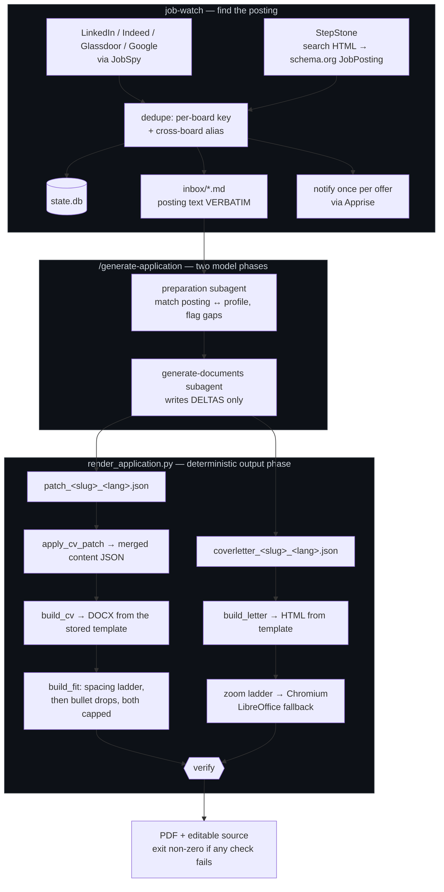

# applications

An agent-driven pipeline that turns a job posting into a tailored, ATS-ready CV
and cover letter — and, upstream of that, finds the postings in the first place. Finding the posting is not yet implemented completely. Generating the CV is.

It is Jacqueline Urban's real job-search workspace, kept public as an engineering
showcase. The interesting part is not that an LLM writes a cover letter. It is
**where the boundary between the model and the code was drawn**, and what
measuring that boundary was worth.

---

## The idea in one sentence

> The model emits only what is a judgement call. Everything mechanical — merging,
> templating, dating, page-fitting, dash hygiene, file naming, verification — is
> deterministic code.

That sounds obvious. It was not how the pipeline started, and the difference is
measurable in both money and correctness.

### What moved out of the model, and what it bought

| Moved into code | Before | After | Why it also made the output *safer* |
|---|---|---|---|
| CV content assembly (`apply_cv_patch.py`) | model rewrote the whole ~8.3 KB content JSON (~2.7k output tokens) | model emits a ~600-token delta | A patch cannot corrupt a date it never mentions. Every field retyped by hand is a field that can quietly go wrong. |
| Cover-letter boilerplate (`build_letter.py`) | model wrote all 5.6 KB of HTML, ~3 KB byte-identical every run | model emits tagline, subject, salutation, paragraphs | The A4 print stylesheet stopped being a thing that could vary between applications. |
| The letter's date | written by the model | computed, with hardcoded month names | A letter dated by a model is a letter that can be dated wrong — and the month name no longer depends on the machine's locale. |
| Page fitting (`build_fit.py`, `fit_cover_letter`) | agent rendered, page-checked, edited down — 7 `Edit` calls in one measured run, each re-reading ~44k tokens of context | capped, deterministic scaling ladder | ~300k read tokens to shorten one page of text, replaced by arithmetic. The cap matters: below the floor it fails loudly instead of shipping something cramped. |
| Fact retrieval (`profile_digest.py`) | every subagent read the 23,933-token `profile.json`, re-read on each call | minified, phase-scoped digests | ~90% of the saving is encoding, ~10% is scoping. The honest split is written into the script's docstring, including the audit that found *less* droppable data than expected. |

Output tokens cost ~5x input and are the entire serial wall-clock of a phase.
Paying a frontier model to retype an A4 stylesheet was the worst trade in the
pipeline.

### The rule that keeps it honest

Everything is built only from facts in `profile.json`. The tooling enforces the
mechanical half of that: `apply_cv_patch.py` **fails loudly** on an ambiguous or
unmatched selector rather than silently dropping a job off the CV, and it emits a
warning when a `select` would remove a work-experience entry — because a missing
job is a gap in an employment history, and gaps get asked about in interviews.

---

## Architecture



`render_application.py` is also the **single definition of file naming**. No agent
prompt and no standards document may spell out an output filename; they ask the
script:

```bash
career-kb/tools/render_application.py --company <company-slug> --lang de --print-paths
```

Its verification step is not decorative — it fails the run if the PDF has the
wrong page count, if the text is not selectable, if an em dash survived, or if
the personal email address leaked into a document that should carry the
application address.

---

## Layout

| Path | What it is |
|---|---|
| [`career-kb/`](career-kb/README.md) | The knowledge base: `profile.json` (single source of truth), channel-scoped writing standards, the DOCX templates, and the render tooling. |
| [`job-watch/`](job-watch/README.md) | Polls the boards, keeps postings verbatim, notifies once per offer. |
| `.claude/` | The agents and slash commands that orchestrate the above (`/generate-application`, `/optimize-linkedin`). |
| `tests/` | 56 unit tests over the pure logic — parsing, merging, hygiene, dedupe. |
| `CODING_RULES.md` | The rules every change to this repo follows. |
| `CLAUDE.md` | Operating instructions for the agent working in this repo. |
| `learnings.md` | The running log of what each measurement actually showed. |

### Which data is committed, and which is not

A pipeline without its data is a pipeline nobody can run, so the **role-generic**
data is in the repository on purpose:

- **`career-kb/profile.json`** — the fact base the whole system is built on.
  Without it, none of the "the model may only use facts from here" design is
  inspectable; you would have to take the claim on faith.
- **`career-kb/content/<role>_<lang>.json`** — the five role-optimized base CVs
  (EN + DE). These are the bases every tailored CV is a patch *against*, so they
  are what makes the delta format legible at all.
- **`career-kb/.digest/*.json`** — build artifacts, tracked deliberately. They are
  what the agents actually read instead of `profile.json`, so tracking them makes
  a stale digest show up in `git diff` rather than silently shipping outdated
  facts. A fresh clone also works with no build step.
- **`job-watch/config.json`** — the real queries and sources. Notification
  credentials are *not* in it: channels are written as `${VAR}` and resolved from
  the environment, and a channel whose variable is unset is skipped with a warning
  instead of failing at send time.

**No company name belongs in this repository.** Who someone applied to, and when,
is nobody else's business — least of all a recruiter's, reading the repo she
linked in her application. So every per-application artifact stays on disk and out
of git: `content/offer_<company>_<lang>.json`, `content/patch_<company>_<lang>.json`,
the letter tone references in `examples/`, and the private source documents in
`career-kb/documents/` (Arbeitszeugnisse and certificates, which name former
employers). `.gitignore` enforces this by the naming convention itself, so a new
application is untracked the moment it is generated rather than by anyone
remembering. In `learnings.md` the runs are pseudonymised as **Company A–J**,
consistently, so each run can still be followed end to end.

Also not committed: the generated PDFs in `career-kb/output/` (reproducible in
~1.7s, so they are output, not knowledge), the scraped `job-watch/inbox/` and its
`state.db`, and the virtualenvs.

The contact details in `profile.json` are the ones already printed on a CV that
gets sent to strangers; the personal email address is a different one, and
`render_application.py` has a check whose entire job is to fail the build if it
ever appears in a generated document.

---

## Quick start

```bash
# everything, exactly as CI runs it
make check

# just the parts you want
make lint typecheck test
make fix          # apply every safe autofix

# render an application from content that already exists
career-kb/tools/render_application.py --company <company-slug> --lang de
```

`make check` creates `.venv` on first run from `requirements-dev.txt`. Rendering
additionally needs `libreoffice`, `chromium` and `poppler-utils` (`pdfinfo`,
`pdftotext`) on `PATH`; a `Dockerfile` and `docker-compose.yml` are included if
you would rather not install those.

---

## Engineering standards

[`CODING_RULES.md`](CODING_RULES.md) is short on purpose: KISS, YAGNI, DRY;
SOLID only where it earns its keep; implement what was asked and nothing
speculative. It also fixes the validation workflow, which is wired into one
command and one CI job so a green local run and a green pipeline mean the same
thing.

| Gate | Tool | Setting |
|---|---|---|
| Lint | Ruff | Explicit rule selection — never inherited defaults, so a Ruff upgrade cannot silently redefine "clean" |
| Format | Ruff Formatter | `quote-style = "preserve"`; the two components differ and normalizing would bury real diffs |
| Types | mypy | Clean across all 14 modules |
| Security | Bandit | No medium-or-higher findings |
| Complexity | Radon / Xenon | No block worse than C, no module worse than B, average A |
| Dead code | Vulture | Clean |
| Tests | pytest + coverage.py | 56 tests |
| Dependencies | pip-audit | See below |

Every suppression in the codebase carries its reason on the same line — the three
`except Exception` in `watch.py` say *one flaky board must not sink the run*; the
naive `datetime` calls say *local wall-clock is the point*; the lazy `import
jobspy` says *heavy import, only pay for it when used*. A `noqa` without a reason
is just a hidden bug.

Coverage sits at **37%**, and that number is honest rather than flattering: the
tests cover the pure logic where a refactor can silently change behaviour —
patch merge and its failure modes, dash hygiene, timespan splitting, bullet
dropping, URL normalization, cross-board dedupe, schema.org extraction. The
uncovered remainder is the subprocess and CLI layer, which is verified end to end
by `render_application.py`'s own checks. One test does build a real CV from the
actual DOCX template, so the template-filling path is exercised against the real
artifact rather than a mock.

### Known open finding

`pip-audit` reports `markdownify 0.13.1` (PYSEC-2026-1604, fixed in 0.14.1). It
arrives transitively through `python-jobspy`, which pins it below the fixed
version — adding the constraint here makes dependency resolution fail. It needs
an upstream `python-jobspy` release, so CI reports it without failing the build.

### A known quirk, documented rather than fixed

`watch.slugify()` runs NFKD normalization *before* its `ä→ae` replacements, so the
umlaut is already decomposed and the expansion never fires: "Müller" becomes
`Muller`, not `Mueller`. That behaviour is pinned by a test with a comment
explaining it, because `slugify` feeds the cross-board alias key — "fixing" it
would make every already-seen German cross-posting look new and re-notify once.
The cheap correct-looking change is the expensive one.

---

## Observability — session tracing

Claude Code sessions are traced to a **self-hosted Langfuse** — turns,
generations, tool calls and token usage — through Langfuse's official Claude Code
plugin. It hooks `Stop` and `SessionEnd`, so it adds nothing to the model's
context. This is where the token numbers at the top of this README come from:
they are measurements, not estimates.

**UI: <http://localhost:33000>** (port 3000 is taken by another container on this
machine).

Langfuse is machine-level infrastructure, **not part of this project**: it traces
every Claude Code session regardless of directory, and nothing in its
configuration references this repository. It therefore lives outside the repo and
is deliberately not versioned here.

| Where | What |
|---|---|
| `[path to langfuse]/` | the upstream clone — `docker compose up -d` · `down` · `ps` · `logs -f langfuse-web` |
| `[path to langfuse]/.env` | ports, secrets, login (mode `0600`) — the only place these values exist |
| `[path to langfuse]/docker-compose.override.yml` | the port bindings; upstream `docker-compose.yml` is untouched so `git pull` upgrades cleanly |
| `~/.claude/settings.json` | plugin config: `LANGFUSE_PUBLIC_KEY`, `LANGFUSE_BASE_URL` (the secret key lives in the OS keychain) |
| `~/.claude/state/langfuse_hook.log` | hook log — first place to look when traces don't arrive |

Health check: `curl -s -o /dev/null -w '%{http_code}\n' http://localhost:33000/api/public/health` → `200`.

<details>
<summary>Activating it in Claude Code elsewhere</summary>

Take the project's API keys from the Langfuse UI (Settings → API Keys) and:

```bash
claude plugin marketplace add langfuse/Claude-Observability-Plugin
claude plugin install langfuse-observability@langfuse-observability \
  --config LANGFUSE_PUBLIC_KEY=pk-lf-… \
  --config LANGFUSE_SECRET_KEY=sk-lf-… \
  --config LANGFUSE_BASE_URL=http://localhost:33000
```

`--config` is only read on install — a second `install` call on an already
installed plugin is a no-op, so change values later with `/plugin configure
langfuse-observability@langfuse-observability`. Hooks take effect in the **next**
session. Requires `uv` on PATH (or Python 3.10+ with `langfuse>=4.0,<5`).

</details>

Setup pitfalls that cost time once are recorded in
[`learnings.md`](learnings.md), not repeated here.

---

## Caveats, stated plainly

- **job-watch is scraping.** None of the three boards has a usable public jobs
  API. It is fine for personal, low-volume use at this cadence; it is against
  LinkedIn's and Indeed's ToS, and selectors break when they redesign. A source
  suddenly returning 0 hits is the usual symptom. See
  [`job-watch/README.md`](job-watch/README.md) for what was verified and when.
- **There is no free API to submit an application** to any board — every ATS
  apply endpoint needs the employer's credentials. This pipeline ends at "here is
  a finished, verified PDF"; sending stays manual, on purpose.
- **This is one person's career, not a product.** There is no vector database
  because embeddings would add an API dependency and fuzzy chunk retrieval to a
  problem that exact structured lookup solves instantly and completely. The
  upgrade path, if it were ever needed, is written down in
  [`career-kb/README.md`](career-kb/README.md).
